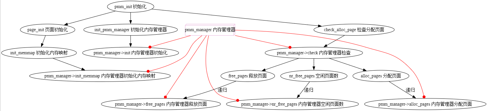

## 练习

对实验报告的要求：
 - 基于markdown格式来完成，以文本方式为主
 - 填写各个基本练习中要求完成的报告内容
 - 完成实验后，请分析ucore_lab中提供的参考答案，并请在实验报告中说明你的实现与参考答案的区别
 - 列出你认为本实验中重要的知识点，以及与对应的OS原理中的知识点，并简要说明你对二者的含义，关系，差异等方面的理解（也可能出现实验中的知识点没有对应的原理知识点）
 - 列出你认为OS原理中很重要，但在实验中没有对应上的知识点

### 练习0：填写已有实验

本实验依赖实验1。请把你做的实验1的代码填入本实验中代码中有“LAB1”的注释相应部分并按照实验手册进行进一步的修改。具体来说，就是跟着实验手册的教程一步步做，然后完成教程后继续完成完成exercise部分的剩余练习。
```CPP
    /* (1) Where are the entry addrs of each Interrupt Service Routine (ISR)?
     *     All ISR's entry addrs are stored in __vectors. where is uintptr_t
     * __vectors[] ?
     *     __vectors[] is in kern/trap/vector.S which is produced by
     * tools/vector.c
     *     (try "make" command in lab1, then you will find vector.S in kern/trap
     * DIR)
     *     You can use  "extern uintptr_t __vectors[];" to define this extern
     * variable which will be used later.
     * (2) Now you should setup the entries of ISR in Interrupt Description
     * Table (IDT).
     *     Can you see idt[256] in this file? Yes, it's IDT! you can use SETGATE
     * macro to setup each item of IDT
     * (3) After setup the contents of IDT, you will let CPU know where is the
     * IDT by using 'lidt' instruction.
     *     You don't know the meaning of this instruction? just google it! and
     * check the libs/x86.h to know more.
     *     Notice: the argument of lidt is idt_pd. try to find it!
     */
        /* (1) 每个中断服务例程 (ISR) 的入口地址在哪里？
        *     所有 ISR 的入口地址都存储在 __vectors 中。uintptr_t __vectors[] 在哪里？
        *     __vectors[] 在 kern/trap/vector.S 中，它是由 tools/vector.c 生成的
        *     （在 lab1 中尝试使用 "make" 命令，然后你会在 kern/trap 目录中找到 vector.S）？？？根本没有vector.S文件！！！
        *     你可以使用 "extern uintptr_t __vectors[];" 来定义这个外部变量，它将在后面使用。
        * (2) 现在你应该在中断描述表 (IDT) 中设置 ISR 的条目。
        *     你能在这个文件中看到 idt[256] 吗？是的，那就是 IDT！你可以使用 SETGATE 宏来设置 IDT 的每一项。
        * (3) 在设置完 IDT 的内容后，你需要使用 'lidt' 指令让 CPU 知道 IDT 的位置。
        *     你不知道这条指令的含义？那就去谷歌一下吧！并查看 libs/x86.h 了解更多信息。
        *     注意：lidt 的参数是 idt_pd。试着找到它！
        */
```
**可是我现在找不到kern/trap/vector.S**wjj

### 练习1：理解first-fit 连续物理内存分配算法（思考题）
first-fit 连续物理内存分配算法作为物理内存分配一个很基础的方法，需要同学们理解它的实现过程。请大家仔细阅读实验手册的教程并结合`kern/mm/default_pmm.c`中的相关代码，认真分析default_init，default_init_memmap，default_alloc_pages， default_free_pages等相关函数，并描述程序在进行物理内存分配的过程以及各个函数的作用。
请在实验报告中简要说明你的设计实现过程。请回答如下问题：
- 你的first fit算法是否有进一步的改进空间？

#### default_init()

##### 函数内容
```cpp
//初始化 free_area 结构体
static void default_init(void) {
    //初始化自由内存块链表和自由内存块计数器：
    list_init(&free_list); //初始化空闲页链表
    nr_free = 0;       //空闲页数量为0
}

```
可以看到`default_init()`的内容就是在对`free_area_t`类型的对象`free_area_default`进行初始化，可以看到`free_area_t`结构体的内容如下：
```cpp
//kern/mm/memlayout.h
/* free_area_t - maintains a doubly linked list to record free (unused) pages 
    free_area_t - 维护一个双向链表来记录空闲（未使用的）页*/
typedef struct {
    list_entry_t free_list;         // the list header 列表头
    unsigned int nr_free;           // number of free pages in this free list 此空闲列表中的空闲页数
} free_area_t;

//kern/mm/default_pmm.c
#define free_list (free_area_default.free_list) 
#define nr_free (free_area_default.nr_free)

```
其中`list_init()`是libs/list.h中将头尾链表指针赋初值的初始化函数，将`free_area_default`的两个成员都初始化。
##### 函数使用

在kern/mm/best_fit_pmm.c中将default_init()的函数指针赋给了init，然后在/kern/mm/pmm.c中的init_pmm_manager()的函数中用已经赋过值的结构体指针直接调用了这一成员函数，就在给结构体赋值之后，起到了一个初始化物理内存管理器的作用。
#### default_init_memmap()
##### 函数内容
```cpp
// 初始化一个自由内存块，并将其添加到自由内存块链表中
static void
default_init_memmap(struct Page *base, size_t n) {
    assert(n > 0); // 确保 n 大于 0
    struct Page *p = base;
    //初始化每一页
    for (; p != base + n; p++) { 
        assert(PageReserved(p)); 
        p->flags = p->property = 0; 
        set_page_ref(p, 0); 
    }
    //处理基页
    base->property = n; 
    SetPageProperty(base); 

    nr_free += n; // 增加空闲页的数量
    if (list_empty(&free_list)) { // 如果空闲列表为空
        list_add(&free_list, &(base->page_link)); // 将基页添加到空闲列表
    } else {
        list_entry_t* le = &free_list;
        while ((le = list_next(le)) != &free_list) { // 遍历空闲列表
            struct Page* page = le2page(le, page_link);
            if (base < page) { // 找到合适的位置插入基页
                list_add_before(le, &(base->page_link)); // 在找到的位置之前插入基页
                break;
            } else if (list_next(le) == &free_list) { // 如果到达列表末尾
                list_add(le, &(base->page_link)); // 将基页添加到列表末尾
            }
        }
    }
}

```
首先对页进行操作，页的定义在kern/mm/memlayout.h中：
```cpp
struct Page {
    int ref;                        // page frame's reference counter 页框的引用计数器
    uint64_t flags;                 // array of flags that describe the status of the page frame 描述页框状态的标志数组
    unsigned int property;          // the num of free block, used in first fit pm manager 空闲块的数量，用于首次适应内存管理器
    list_entry_t page_link;         // free list link 空闲列表链接
};

```
代码在简单的判断n>0之后，开始清理每个页。需要注意的是，这里面的p++:
```cpp
    assert(n > 0); // 确保 n 大于 0
    struct Page *p = base;
    //初始化每一页
    for (; p != base + n; p++) { //注意p++
        assert(PageReserved(p)); 
        p->flags = p->property = 0; 
        set_page_ref(p, 0); 
    }

```

`p` 是一个指向 `struct Page` 的指针，`p++` 操作将使指针 `p` 指向下一个 `struct Page` 结构体。当对结构体指针进行自增操作（`p++`），这并不是简单的增加一个字节，而是会跳过整个结构体的大小。也就是说，`p++` 会使指针 `p` 增加相当于 `struct Page` 结构体大小的字节数，指向内存中的下一个 `struct Page` 实例。每次 `p++` 实际上是在内存中跳过 `sizeof(struct Page)` 个字节，并指向下一个 `struct Page` 结构体。这样就可以在循环中逐一处理内存块中的每一页。

其中`static inline void set_page_ref(struct Page *page, int val) { page->ref = val; }`是一个kern/mm/pmm.h的内联函数，可以看到三行代码将页的引用计数器，状态数组和空闲块数量都置0了。


```cpp
    //处理基页
    base->property = n; 
    SetPageProperty(base); 
     nr_free += n; // 增加空闲页的数量
```
对于基页也就是第一页，把空闲块数量置n,然后采用宏定义的方式设置他的状态数组，证明此页是一个空闲内存块的头页（包含一些连续地址的页），可以在 alloc_pages 中使用。之后对应的增加空闲页的数量。

```cpp
    //插入页
    if (list_empty(&free_list)) { // 如果空闲列表为空
        list_add(&free_list, &(base->page_link)); // 将基页添加到空闲列表
    } else {
        list_entry_t* le = &free_list;
        while ((le = list_next(le)) != &free_list) { // 遍历空闲列表
            struct Page* page = le2page(le, page_link);
            if (base < page) { // 找到合适的位置插入基页
                list_add_before(le, &(base->page_link)); // 在找到的位置之前插入基页
                break;
            } else if (list_next(le) == &free_list) { // 如果到达列表末尾
                list_add(le, &(base->page_link)); // 将基页添加到列表末尾
            }
        }
    }

```
在最后就是一个插入页的过程，利用libs/list.h中对链表的操作，在空链表的时候直接加入，不空的话顺序遍历，找到可以的区域进行插入。
##### 函数使用
在kern/mm/best_fit_pmm.c中将default_memmap()的函数指针赋给了init，然后在/kern/mm/pmm.c中的page_init()的函数中用已经赋过值的结构体指针直接调用了这一成员函数:


```cpp
    if (freemem < mem_end) {
        //初始化我们可以自由使用的物理内存
        init_memmap(pa2page(mem_begin), (mem_end - mem_begin) / PGSIZE);
    }
```
这里面传入的参数是可以自由使用的物理内存的起始页面和可用的大小，进行空间的初始化。
#### default_free_pages()
##### 函数内容

```cpp
// 释放 n 个连续的物理页
static void
default_free_pages(struct Page *base, size_t n) {
  assert(n > 0); // 确保 n 大于 0
  struct Page *p = base;
  // 遍历并释放每一页
  for (; p != base + n; p ++) {
    assert(!PageReserved(p) && !PageProperty(p)); // 确保页未被保留且无属性
    p->flags = 0; // 清除页标志
    set_page_ref(p, 0); // 设置页引用计数为 0
  }
  base->property = n; // 设置基页属性为 n
  SetPageProperty(base); // 设置基页属性标志
  nr_free += n; // 增加空闲页数量

  // 如果空闲列表为空，直接添加基页
  if (list_empty(&free_list)) {
    list_add(&free_list, &(base->page_link));
  } else {
    list_entry_t* le = &free_list;
    // 遍历空闲列表，找到合适位置插入基页
    while ((le = list_next(le)) != &free_list) {
      struct Page* page = le2page(le, page_link);
      if (base < page) {
        list_add_before(le, &(base->page_link));
        break;
      } else if (list_next(le) == &free_list) {
        list_add(le, &(base->page_link));
      }
    }
  }


    // 合并前面的空闲页
    list_entry_t* le = list_prev(&(base->page_link)); // 获取前一个链表项
    if (le != &free_list) { // 如果前一个链表项不是空闲列表头
      p = le2page(le, page_link); // 获取前一个页
      if (p + p->property == base) { // 如果前一个页的末尾与当前基页的起始地址相同
        p->property += base->property; // 合并前一个页和当前基页的属性
        ClearPageProperty(base); // 清除当前基页的属性标志
        list_del(&(base->page_link)); // 从链表中删除当前基页
        base = p; // 更新基页为前一个页
      }
    }


  // 合并后面的空闲页
    le = list_next(&(base->page_link)); // 获取后一个链表项
    if (le != &free_list) { // 如果后一个链表项不是空闲列表头
      p = le2page(le, page_link); // 获取后一个页
      if (base + base->property == p) { // 如果当前基页的末尾与后一个页的起始地址相同
        base->property += p->property; // 合并当前基页和后一个页的属性
        ClearPageProperty(p); // 清除后一个页的属性标志
        list_del(&(p->page_link)); // 从链表中删除后一个页
      }
    }
  }
```
在释放内存的过程中，指定了要释放的基页和大小之后，一开始的操作和初始化内存块页是一样的，都是遍历释放每一页，处理基页并插入到链表里面：
```cpp
  assert(n > 0); // 确保 n 大于 0
  struct Page *p = base;
  // 遍历并释放每一页
  for (; p != base + n; p ++) {
    assert(!PageReserved(p) && !PageProperty(p)); // 确保页未被保留且无属性
    p->flags = 0; // 清除页标志
    set_page_ref(p, 0); // 设置页引用计数为 0
  }
  base->property = n; // 设置基页属性为 n
  SetPageProperty(base); // 设置基页属性标志
  nr_free += n; // 增加空闲页数量

  // 如果空闲列表为空，直接添加基页
  if (list_empty(&free_list)) {
    list_add(&free_list, &(base->page_link));
  } else {
    list_entry_t* le = &free_list;
    // 遍历空闲列表，找到合适位置插入基页
    while ((le = list_next(le)) != &free_list) {
      struct Page* page = le2page(le, page_link);
      if (base < page) {
        list_add_before(le, &(base->page_link));
        break;
      } else if (list_next(le) == &free_list) {
        list_add(le, &(base->page_link));
      }
    }
  }

```
此后对于两种特殊情况进行处理：
+ 如果前一个链表项不是空闲列表头，并且前一个页的末尾与当前基页的起始地址相同的话，就需要合并前一个页；
+ 如果后一个链表项不是空闲列表头，并且当前基页的末尾与后一个页的起始地址相同的话，就需要合并后一个页；
这样可以减少内存碎片，把相邻的空闲页面合并成一个更大的块，方便将来分配大块连续的内存。并且合并后减少了内存管理中的链表项，简化内存管理，减少系统开销。

```cpp
    // 合并前面的空闲页
    list_entry_t* le = list_prev(&(base->page_link)); // 获取前一个链表项
    if (le != &free_list) { // 如果前一个链表项不是空闲列表头
      p = le2page(le, page_link); // 获取前一个页
      if (p + p->property == base) { // 如果前一个页的末尾与当前基页的起始地址相同
        p->property += base->property; // 合并前一个页和当前基页的属性
        ClearPageProperty(base); // 清除当前基页的属性标志
        list_del(&(base->page_link)); // 从链表中删除当前基页
        base = p; // 更新基页为前一个页
      }
    }


  // 合并后面的空闲页
    le = list_next(&(base->page_link)); // 获取后一个链表项
    if (le != &free_list) { // 如果后一个链表项不是空闲列表头
      p = le2page(le, page_link); // 获取后一个页
      if (base + base->property == p) { // 如果当前基页的末尾与后一个页的起始地址相同
        base->property += p->property; // 合并当前基页和后一个页的属性
        ClearPageProperty(p); // 清除后一个页的属性标志
        list_del(&(p->page_link)); // 从链表中删除后一个页
      }
    }
```
##### 函数使用

在kern/mm/best_fit_pmm.c中将default_free_pages()的函数指针赋给了init，然后在/kern/mm/pmm.c中的free_pages()的函数中用已经赋过值的结构体指针直接调用了这一成员函数:
```cpp
void free_pages(struct Page *base, size_t n) {
    bool intr_flag;
    local_intr_save(intr_flag);//保存当前中断状态并禁用中断
    {
        pmm_manager->free_pages(base, n);
    }
    local_intr_restore(intr_flag);//恢复之前的中断状态
}
```
需要注意的是，这里面为了避免混淆，使用花括号围住中间那行代码，主要原因是为了创建一个新的作用域，避免命名冲突，增强可读性。
在default_check()中反复调用，进行检查；
#### default_alloc_pages()
##### 函数内容
```cpp
//分配 n 个连续的物理页
static struct Page *
default_alloc_pages(size_t n) {
    assert(n > 0); // 确保 n 大于 0
    if (n > nr_free) { // 如果请求的页数大于空闲页数，返回 NULL
        return NULL;
    }
    struct Page *page = NULL;
    list_entry_t *le = &free_list;
    // 遍历空闲列表，找到第一个满足条件的空闲块
    while ((le = list_next(le)) != &free_list) {
        struct Page *p = le2page(le, page_link);
        if (p->property >= n) { // 找到一个空闲块，其大小大于或等于 n
            page = p;
            break;
        }
    }
    if (page != NULL) {
        list_entry_t* prev = list_prev(&(page->page_link));
        list_del(&(page->page_link)); // 从空闲列表中删除该块
        if (page->property > n) { // 如果空闲块大小大于 n
            struct Page *p = page + n;
            p->property = page->property - n; // 更新剩余块的大小
            SetPageProperty(p); // 设置剩余块的属性
            list_add(prev, &(p->page_link)); // 将剩余块添加回空闲列表
        }
        nr_free -= n; // 更新空闲页数
        ClearPageProperty(page); // 清除已分配块的属性
    }
    return page; // 返回分配的页
}

```
分配的页面的方法是遍历空闲列表，找到第一个其大小大于或等于n的空闲块，进行分配：

```cpp
    assert(n > 0); // 确保 n 大于 0
    if (n > nr_free) { // 如果请求的页数大于空闲页数，返回 NULL
        return NULL;
    }
    struct Page *page = NULL;
    list_entry_t *le = &free_list;
    // 遍历空闲列表，找到第一个满足条件的空闲块
    while ((le = list_next(le)) != &free_list) {
        struct Page *p = le2page(le, page_link);
        if (p->property >= n) { // 找到一个空闲块，其大小大于或等于 n
            page = p;
            break;
        }
    }

```
如果成功找到了需要分配的块，接下来对分配出去的这块做切割：
+ 满足当前请求的的n个页
+ 剩余的页放回到空闲列表中
通过先在链表中删除，切割之后把剩余的在放回的方式，将剩余块的属性设置为PG_property，使用块的PG_property清理掉。
```cpp
    if (page != NULL) {
        list_entry_t* prev = list_prev(&(page->page_link));
        list_del(&(page->page_link)); // 从空闲列表中删除该块
        if (page->property > n) { // 如果空闲块大小大于 n
            struct Page *p = page + n;
            p->property = page->property - n; // 更新剩余块的大小
            SetPageProperty(p); // 设置剩余块的属性
            list_add(prev, &(p->page_link)); // 将剩余块添加回空闲列表
        }
        nr_free -= n; // 更新空闲页数
        ClearPageProperty(page); // 清除已分配块的属性
    }
    return page; // 返回分配的页

```
##### 函数使用

在kern/mm/best_fit_pmm.c中将default_alloc_pages()的函数指针赋给了init，然后在/kern/mm/pmm.c中的alloc_pages()的函数中用已经赋过值的结构体指针直接调用了这一成员函数:
```cpp
struct Page *alloc_pages(size_t n) {
    struct Page *page = NULL;
    bool intr_flag;
    local_intr_save(intr_flag);
    {
        page = pmm_manager->alloc_pages(n);
    }
    local_intr_restore(intr_flag);
    return page;
}
在后续的check中反复调用。
```

```cpp
```
```cpp
```
```cpp
```

这一部分的代码


#### 进一步的改进空间

##### 1. **性能优化**
   - **跳过无效的空闲块**：在 `default_alloc_pages` 中，在空闲列表中逐个遍历，找到第一个满足大小要求的块。如果空闲列表很长，这种线性遍历可能会影响性能。可以考虑通过增加更智能的数据结构（如平衡树或有序链表），让每次分配更快地找到合适的块，从而减少不必要的遍历。
   
   - **快速合并**：在 `default_free_pages` 中的块合并逻辑是线性查找相邻的空闲块进行合并操作。如果能对空闲块列表进行更有组织的管理（比如通过合并相邻页块时保持列表的顺序），可能可以减少遍历时间。

##### 2. **碎片化管理**
   - **避免内存碎片化**：首次适应算法的一个问题是可能导致内存碎片化。当多个小块被分配和释放后，可能会在内存中产生多个不连续的小块，导致无法满足较大内存分配请求。你可以考虑引入碎片化检测和整理机制，当碎片过多时进行内存的整理和合并，进一步减少碎片化问题。

##### 3. **合并的改进**
   - **主动合并空闲块**：当前实现是基于释放内存块后立即尝试与相邻块合并。可以考虑采用延迟合并机制，例如每次分配和释放后不立即合并，而是在分配器空闲时，或当内存请求较大且碎片过多时，再去合并。这可以避免频繁的合并操作。

##### 4. **减少 `list_next` 和 `list_prev` 操作**
   - **提升列表操作效率**：在 `default_free_pages` 函数中，频繁使用 `list_next` 和 `list_prev` 来查找插入位置。你可以考虑为空闲块链表维护一个双向链表，使得合并操作更直接，减少不必要的链表遍历。例如，当释放内存块时，可以根据释放块的位置更快地找到相邻的空闲块。

##### 5. **内存块分裂时的优化**
   - **减少块的分裂次数**：在分配过程中，当找到一个足够大的块时，当前实现会立即将该块分裂成两个部分，一个分配给用户，另一个保留在空闲列表中。如果内存块稍微比请求的内存大一些，可以考虑避免分裂，以减少分裂操作带来的管理开销。

##### 6. **提前检查边界情况**
   - **避免空闲列表中的重复检查**：在释放页面时，你会重新遍历整个空闲列表查找插入位置。可以在链表中维护一些额外的元数据，例如按地址大小排序的最小和最大空闲块，这样可以在某些情况下跳过列表遍历，直接确定插入点。

##### 7. **调试与日志**
   - **引入调试日志**：你可以在分配和释放内存时引入日志输出，方便调试和监控内存的分配状态以及内存碎片的情况。这可以帮助你发现潜在的内存碎片化问题，以及分配性能瓶颈。

通过以上优化，你可以显著提高首次适应内存分配算法的性能并减少碎片化现象。
### 练习2：实现 Best-Fit 连续物理内存分配算法（需要编程）
在完成练习一后，参考kern/mm/default_pmm.c对First Fit算法的实现，编程实现Best Fit页面分配算法，算法的时空复杂度不做要求，能通过测试即可。
请在实验报告中简要说明你的设计实现过程，阐述代码是如何对物理内存进行分配和释放，并回答如下问题：
- 你的 Best-Fit 算法是否有进一步的改进空间？

首先First fit算法实现和Best Fit页面分配算法实现非常类似，因为本质上二者都是页面分配算法，只是在分配的过程中侧重不同，
主要有区别的地方为：first fit算法在进行分配时，遍历所有页面空闲页的时候会直接将找到的第一个满足要求的页（意为页大小满足分配需要），直接进行分配。
而对于best fit算法，他会找到所有满足要求的页，之后选出最小的那个（即“最满足要求”）进行分配。


### 扩展练习Challenge：buddy system（伙伴系统）分配算法（需要编程）

Buddy System算法把系统中的可用存储空间划分为存储块(Block)来进行管理, 每个存储块的大小必须是2的n次幂(Pow(2, n)), 即1, 2, 4, 8, 16, 32, 64, 128...

 -  参考[伙伴分配器的一个极简实现](http://coolshell.cn/articles/10427.html)， 在ucore中实现buddy system分配算法，要求有比较充分的测试用例说明实现的正确性，需要有设计文档。
 
### 扩展练习Challenge：任意大小的内存单元slub分配算法（需要编程）

slub算法，实现两层架构的高效内存单元分配，第一层是基于页大小的内存分配，第二层是在第一层基础上实现基于任意大小的内存分配。可简化实现，能够体现其主体思想即可。

 - 参考[linux的slub分配算法/](http://www.ibm.com/developerworks/cn/linux/l-cn-slub/)，在ucore中实现slub分配算法。要求有比较充分的测试用例说明实现的正确性，需要有设计文档。

### 扩展练习Challenge：硬件的可用物理内存范围的获取方法（思考题）
  - 如果 OS 无法提前知道当前硬件的可用物理内存范围，请问你有何办法让 OS 获取可用物理内存范围？


不断的分配，直到引发异常trap
为了将内核自行探测内存大小的方法与异常处理机制结合，核心思路是：在内核通过逐页访问物理内存探测其大小的过程中，如果访问到非法的或不可用的物理地址，处理器会触发异常（例如“加载/存储错误”异常），此时内核通过异常处理机制捕获这些异常，确保探测过程安全且不会崩溃。

下面是具体的步骤和改进：

#### 1. **异常处理与内存探测的结合**
在进行物理内存探测时，当访问无效的物理地址，系统会产生如“加载错误（`FAULT_LOAD`）”或“存储错误（`FAULT_STORE`）”的异常。你可以通过修改异常处理器，使其识别出当前正在进行内存探测操作，并在捕获异常时终止探测过程，记录有效的内存范围。

我们可以通过在异常处理器中增加特定标记来区分探测期间的异常和其他异常。

#### 2. **修改异常处理器**
首先，扩展 `exception_handler`，增加对探测期间产生的异常的处理。为此，我们可以引入一个全局变量 `is_mem_probe`，当内存探测过程开始时将其设为 `true`，探测结束后再将其恢复为 `false`。

```c
bool is_mem_probe = false;  // 标记是否在进行内存探测

void exception_handler(struct trapframe *tf) {
    // 检查是否在进行内存探测
    if (is_mem_probe) {
        switch (tf->cause) {
            case CAUSE_FAULT_LOAD:
            case CAUSE_FAULT_STORE:
                // 在内存探测时，加载或存储错误表示内存探测到无效区域
                // 直接返回以终止探测过程
                return;
            default:
                // 如果发生其他异常类型，在探测期间未处理的异常应当终止探测
                print_trapframe(tf);
                panic("Unexpected exception during memory probing!");
        }
    }
    
    // 正常异常处理
    switch (tf->cause) {
        case CAUSE_MISALIGNED_FETCH:
            break;
        case CAUSE_FAULT_FETCH:
            break;
        case CAUSE_ILLEGAL_INSTRUCTION:
            break;
        case CAUSE_BREAKPOINT:
            break;
        case CAUSE_MISALIGNED_LOAD:
            break;
        case CAUSE_FAULT_LOAD:
            break;
        case CAUSE_MISALIGNED_STORE:
            break;
        case CAUSE_FAULT_STORE:
            break;
        case CAUSE_USER_ECALL:
            break;
        case CAUSE_SUPERVISOR_ECALL:
            break;
        case CAUSE_HYPERVISOR_ECALL:
            break;
        case CAUSE_MACHINE_ECALL:
            break;
        default:
            print_trapframe(tf);
            panic("Unknown exception!");
    }
}
```

#### 3. **改进内存探测函数**
接下来，在内存探测函数 `detect_physical_memory_size` 中，在探测开始时设置 `is_mem_probe` 为 `true`，当探测完成后将其恢复为 `false`。同时，我们不需要使用过于复杂的写读测试，只需要在遇到加载或存储异常时捕获并停止探测即可。

```c
static size_t detect_physical_memory_size(void) {
    uint64_t current_addr = mem_probe_start;  // 从物理内存起始地址开始探测
    size_t detected_pages = 0;                // 已检测到的可用物理页面数量

    // 标记开始内存探测
    is_mem_probe = true;

    while (current_addr < mem_probe_end) {
        volatile uint64_t *test_addr = (volatile uint64_t *)PADDR(current_addr);

        // 尝试访问该地址，捕获任何加载/存储错误异常
        // 这里不需要显式地捕获错误，异常处理器会处理无效访问
        uint64_t value = *test_addr;

        // 如果成功访问，继续探测下一页
        current_addr += PGSIZE;
        detected_pages++;
    }

    // 探测完成，恢复标记
    is_mem_probe = false;

    return detected_pages;
}
```

在这个版本中，如果访问了无效的内存地址，系统将触发加载/存储错误异常。此时，异常处理器会检查 `is_mem_probe` 变量，判断当前正在进行内存探测，并返回以终止探测过程。这种方式能够确保在探测过程中不会导致系统崩溃。

#### 4. **将内存探测集成到内存管理初始化中**
最后，将内存探测逻辑集成到内存管理器的初始化流程中。修改 `page_init` 函数，使其在初始化过程中首先探测物理内存大小，并根据探测结果设置物理内存页数。

```c
static void page_init(void) {
    va_pa_offset = PHYSICAL_MEMORY_OFFSET;

    uint64_t mem_begin = KERNEL_BEGIN_PADDR;
    uint64_t mem_size = PHYSICAL_MEMORY_END - KERNEL_BEGIN_PADDR;
    uint64_t mem_end = PHYSICAL_MEMORY_END;

    cprintf("physical memory map:\n");
    cprintf("  memory: 0x%016lx, [0x%016lx, 0x%016lx].\n", mem_size, mem_begin, mem_end - 1);

    // 调用内存探测函数，获取实际的物理内存页数
    size_t detected_pages = detect_physical_memory_size();
    cprintf("Detected physical memory pages: %lu\n", detected_pages);

    // 根据探测到的页面数量初始化
    npage = detected_pages;

    // 初始化页面数组，指向内核后面的页面
    pages = (struct Page *)ROUNDUP((void *)end, PGSIZE);

    // 将所有页面标记为内核保留状态
    for (size_t i = 0; i < npage - nbase; i++) {
        SetPageReserved(pages + i);
    }

    // 标记可用的物理内存区域
    uintptr_t freemem = PADDR((uintptr_t)pages + sizeof(struct Page) * (npage - nbase));
    mem_begin = ROUNDUP(freemem, PGSIZE);
    mem_end = ROUNDDOWN(mem_end, PGSIZE);
    
    if (freemem < mem_end) {
        init_memmap(pa2page(mem_begin), (mem_end - mem_begin) / PGSIZE);
    }
}
```

#### 5. **总结**
通过结合异常处理机制，内核能够在探测物理内存时安全地捕获无效地址访问，避免系统崩溃。这种方法不仅有效地探测了系统中实际可用的物理内存，还充分利用了异常处理机制确保探测过程的安全性。

主要改进点如下：
1. **标记内存探测过程**：通过 `is_mem_probe` 标记探测期间的异常，异常处理器可以做出适当反应。
2. **探测期间异常捕获**：在异常处理器中，根据 `cause` 判断当前是否在进行内存探测，并安全退出探测过程。
3. **改进探测流程**：探测内存时不必显式捕获错误，由异常处理器处理非法访问即可终止探测。

这种方案确保了探测过程中不会出现系统崩溃，并且可以安全、稳定地确定系统的物理内存大小。

> Challenges是选做，完成Challenge的同学可单独提交Challenge。完成得好的同学可获得最终考试成绩的加分。